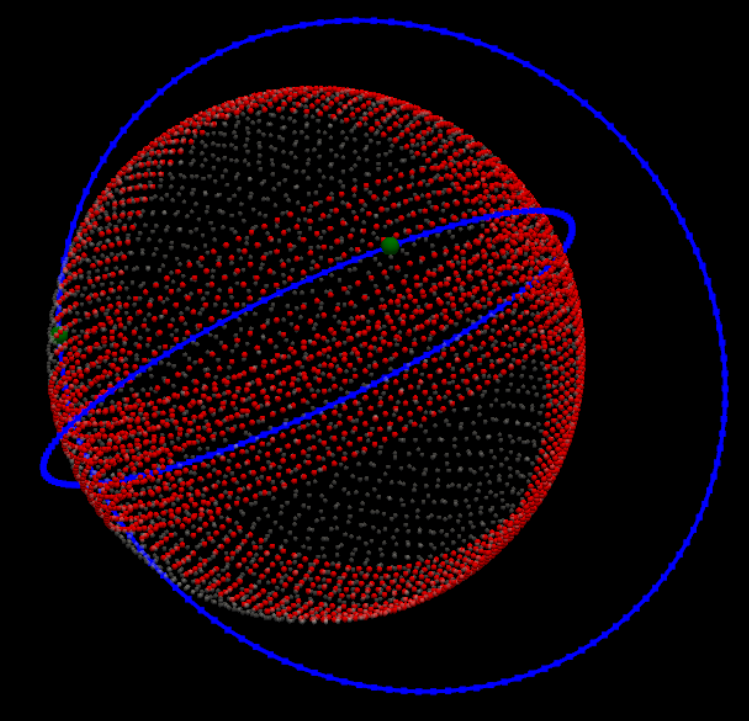

# Satellite Arena: Orbital Coverage RL Demo

This project simulates a multi-agent satellite environment for orbital coverage, designed for reinforcement learning (RL) research and visualization. It features physically accurate orbital mechanics, real-time 3D visualization, and ego-centric observation tensors suitable for deep learning.

## Features
- **Keplerian Physics**: Satellites propagate using the universal variables Kepler equation for robust, accurate orbits.
- **Tsiolkovsky Rocket Equation**: Each satellite has mass, fuel, and realistic thrust limits.
- **Ego-Centric Control**: Agents command thrust in their local RSW/RTN (Radial, Transverse, Normal) frame, mapped to global coordinates.
- **HEALPix Mapping**: Global coverage is tracked using HEALPix pixelization, ideal for spherical CNNs.
- **4-Channel Observations**: Each agent receives a local tensor with steady-state coverage, current coverage, priority, and altitude.
- **PyVista Visualization**: Real-time 3D rendering of orbits, coverage bands, and satellite positions.

## File Overview
- `mechanics.py`: Math utilities, orbit propagation, HEALPix mapping, and visualization routines.
- `satellite.py`: Satellite agent class with thrust, mass, and step logic.
- `orbital_env.py`: Environment class managing simulation, agent stepping, and rendering loop.

## How It Works
1. **Initialization**: Satellites are spawned in random low Earth orbits with random velocities.
2. **Simulation Loop**: Each step, agents choose a thrust vector (ego-centric). The environment updates positions, velocities, and fuel.
3. **Coverage Mapping**: Orbits and current positions are projected onto a HEALPix sphere, updating global coverage maps.
4. **Observation Extraction**: Each agent receives a 4-channel tensor representing its local coverage and altitude context.
5. **Visualization**: PyVista renders the Earth, orbits (blue), coverage bands (red, fading with time), and satellite positions (green).

## Running the Demo
1. **Dependencies**: Requires Python 3.8+ and the following packages:
   - numpy
   - healpy
   - pyvista
   - matplotlib

   Install with:
   ```bash
   pip install numpy healpy pyvista matplotlib
   ```

2. **Run the Environment**:
   ```bash
   python orbital_env.py
   ```
   Or, if using WSL/venv:
   ```bash
   wsl -d Ubuntu -e bash -c "source .venv/bin/activate && python3 orbital_env.py"
   ```

3. **Controls**: The simulation runs automatically, stepping satellites and updating the visualization in real time.

## Key Concepts
- **RSW/RTN Frame**: Local satellite axes (Radial, Transverse, Normal) allow intuitive, game-engine-style control.
- **HEALPix**: Hierarchical Equal Area isoLatitude Pixelization, ideal for mapping spherical data.
- **Observation Tensor**: Shape `(4, N_rows, N_cols)`, channels are steady-state, current, priority, and altitude.

## Customization
- Change the number of satellites, HEALPix resolution, or simulation steps in `orbital_env.py`.
- Modify agent actions to implement RL policies or scripted behaviors.

## Applications
- RL research for satellite constellation management
- Orbital coverage optimization
- Spherical CNN training data generation
- Educational orbital mechanics visualization

---

**Author:** Satellite Arena Demo
